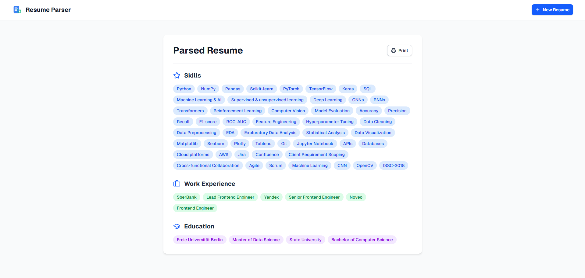

# 🤖 AI-Powered Resume Parser

An end-to-end system that extracts **structured data**—Skills, Work Experience, Education, and Languages—from resumes in **PDF, DOCX, and TXT** formats.  

Built with a **fine-tuned RoBERTa-base model** (via spaCy-transformers), a **FastAPI backend**, and a **React frontend**—achieving **96.77% F1-score** on resume entity recognition.

---

## 🚀 Project Highlights


- **Dataset:** 60 resumes (1,555 annotated entities)  (42 train, 8 dev, 10 test)  
- **Model:** **spaCy transformer** (RoBERTa-base fine-tuned)  
- **Best Test F1-score:** **96.77%** (overall)  
- **Entities extracted:** Skills, Work Experience, Education, Languages  

---

## 🖼️ Screenshots

**Upload Page**  


**Parsed Resume Results**  


---

## ✨ Features
- 📂 Upload resumes (PDF, DOCX, TXT).  
- 🤖 AI-powered extraction of:
  - 🎯 **Skills**
  - 💼 **Work Experience**
  - 🎓 **Education**
  - 🌍 **Languages**  
- 📊 Instant structured output for downstream use.  
- 💻 Web interface + REST API.  

---

## 🛠️ Tech Stack & Tools

- **Languages:** Python, TypeScript  
- **NLP Framework:** **spaCy transformers** (RoBERTa-base)
- **Backend:** FastAPI, Uvicorn  
- **Frontend:** React / Next.js  
- **Parsing Tools:** pdfplumber, docx2txt  
- **Data Annotation:** Label Studio  
- **Pretrained Model:** RoBERTa-base
- **DevOps & Tools:** Git, Docker, AWS, Vercel
- **Methodologies:** Data preprocessing, tokenization, regex bootstrapping, model evaluation with F1/Precision/Recall  

---

## 🧠 Model Architecture

The resume parser now uses a **fine-tuned transformer model** for superior entity recognition:

### Transformer Backbone
- **Base Model:** **RoBERTa-base** (125M parameters)
- **Framework:** spaCy-transformers
- **Training:** Fine-tuned on resume domain

### Training Configuration
- **Learning Rate:** 5e-5 with linear warmup
- **Batch Size:** 128 with dynamic padding
- **Max Steps:** 20,000 with early stopping (patience: 1,600 steps)
- **Optimizer:** AdamW with weight decay

### Advantages over Previous Model
- ✅ **Better contextual understanding** of resume text
- ✅ **Improved generalization** to unseen resume formats
- ✅ **Higher accuracy** on complex entity boundaries
- ✅ **State-of-the-art** transformer architecture
---
## 🧠 Model Training

The **spaCy transformer model** was fine-tuned on manually annotated resumes using transfer learning:

- **Base Model:** RoBERTa-base (pretrained on general text)
- **Fine-tuning Dataset:** 60 annotated resumes  
- **Split:**  
  - 42 resumes → Training  
  - 8 resumes → Development (validation)  
  - 10 resumes → Test (final evaluation)  

### Training Pipeline:
- Text extraction & normalization from PDF/DOCX
- Transformer tokenization with RoBERTa tokenizer
- Fine-tuning with spaCy's transformer NER architecture
- Early stopping to prevent overfitting
- Comprehensive evaluation on held-out test set

---

## 📊 Evaluation Results

On the held-out **test set (10 resumes)**:

| Metric | Score |
|--------|-------|
| **Precision (NER P)** | 95.02% |
| **Recall (NER R)**    | 98.59% |
| **F1-score (NER F)**  | 96.77% |

### Per-entity performance:

| Entity       | Precision | Recall | F1    |
|--------------|-----------|--------|-------|
| 🎓 Education | 96.97     | 96.97  | 96.97 |
| 💼 Work Exp. | 84.62     | 100.00 | 91.67 |
| 🎯 Skill     | 95.77     | 98.55  | 97.14 |
| 🌐 Language  | 100.00    | 100.00 | 100.00 |


⚡ **Why not accuracy?**  
For NER tasks, **accuracy is misleading** because the majority of tokens are *not entities*. Instead, the **F1-score (harmonic mean of precision & recall)** is the gold-standard metric in NLP.  

---

## 🔧 Currently Improving Model Accuracy

I'm currently improving the accuracy of the Resume Parser using these methodologies:

### 📊 Data-Centric
- Expanding dataset with more annotated resumes (beyond current 60).  
- Annotating more **Work Experience** and **Education** entities to address weaker categories.  
- Reviewing and enforcing **annotation consistency** (e.g., clear rules for job titles, companies, skills).  

### 🤖 Model-Centric
- Experimenting with larger **spaCy models** (`en_core_web_md`, `en_core_web_lg`).  
- Fine-tuning **transformer-based models** (BERT, RoBERTa) using `spacy-transformers`.  
- Hyperparameter tuning: adjusting **learning rate, batch size, training iterations**.

---

## ⚡ Installation & Usage

### 1. Clone repo
```bash
git clone https://github.com/yourusername/resume-parser.git
cd resume-parser
```

### 2. Setup backend
```bash
cd backend
pip install -r requirements.txt
uvicorn main:app --reload
```

### 3. Setup frontend
```bash
cd frontend
npm install
npm run dev
```

### 4. Test API
```bash 
curl -X POST "http://localhost:8000/parse" \
     -F "file=@sample_resume.pdf"
```

## 📌 License

MIT License. Free to use & modify.
