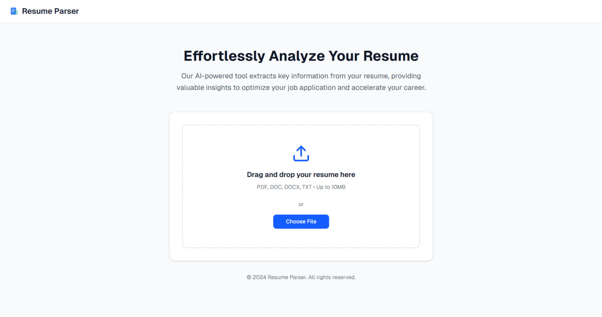
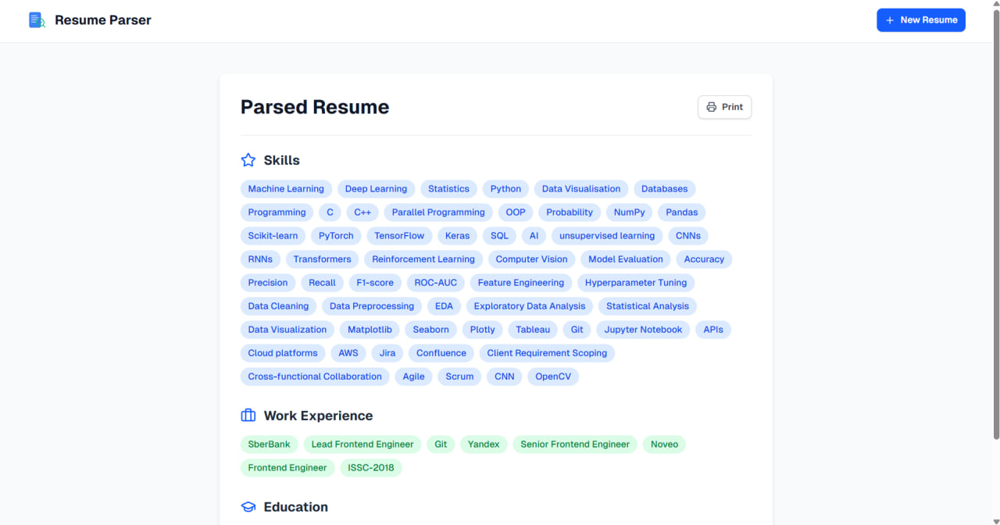

# 📄 Resume Parser (AI-powered)

An end-to-end **Resume Parser** that extracts structured information (Skills, Work Experience, Education, Languages) from resumes in **PDF/DOCX/TXT** formats.  
Built with **spaCy (NER model)**, **FastAPI backend**, and **React frontend**.

---

## 🚀 Project Highlights


- **Dataset:** 50 resumes (42 train, 8 dev, 10 test)  
- **Model:** Custom **spaCy NER** (trained from scratch)  
- **Best Test F1-score:** **84.58%** (overall)  
- **Entities extracted:** Skills, Work Experience, Education, Languages  

---

## 🖼️ Screenshots

**Upload Page**  


**Parsed Resume Results**  


---

## ✨ Features
- 📂 Upload resumes (PDF, DOCX, TXT).  
- 🤖 AI-powered extraction of:
  - 🎯 **Skills**
  - 💼 **Work Experience**
  - 🎓 **Education**
  - 🌍 **Languages**  
- 📊 Instant structured output for downstream use.  
- 💻 Web interface + REST API.  

---

## 🛠️ Tech Stack & Tools

- **Languages:** Python, TypeScript  
- **NLP Framework:** spaCy  
- **Backend:** FastAPI, Uvicorn  
- **Frontend:** React / Next.js  
- **Parsing Tools:** pdfplumber, docx2txt  
- **Data Annotation:** Label Studio  
- **DevOps & Tools:** Git, Virtualenv, npm  
- **Methodologies:** Data preprocessing, tokenization, regex bootstrapping, model evaluation with F1/Precision/Recall  

---

## 🧠 Model Training

The custom **spaCy NER model** was trained on manually annotated resumes.

- **Dataset size:** 50 resumes  
- **Split:**  
  - 42 resumes → Training  
  - 8 resumes → Development (validation)  
  - 10 resumes → Test (final evaluation)  

Pipeline included:
- Text cleaning & normalization  
- Regex pre-labeling to speed up annotation  
- Train/dev/test splitting for fair evaluation  
- Iterative fine-tuning of model  

---

## 📊 Evaluation Results

On the held-out **test set (10 resumes)**:

| Metric | Score |
|--------|-------|
| **Precision (NER P)** | 87.70% |
| **Recall (NER R)**    | 81.68% |
| **F1-score (NER F)**  | 84.58% |

### Per-entity performance:

| Entity            | Precision | Recall | F1  |
|-------------------|-----------|--------|-----|
| 🎓 Education      | 81.82     | 81.82  | 81.82 |
| 💼 Work Exp.      | 88.89     | 72.73  | 80.00 |
| 🎯 Skill          | 87.28     | 80.75  | 83.89 |
| 🌍 Language       | 100.00    | 100.00 | 100.00 |

⚡ **Why not accuracy?**  
For NER tasks, **accuracy is misleading** because the majority of tokens are *not entities*. Instead, the **F1-score (harmonic mean of precision & recall)** is the gold-standard metric in NLP.  

---

## 📈 Current Improvements

Right now, I am working on improving model accuracy by:  
- Expanding the dataset with **synthetic resumes** (data augmentation).  
- Using **active learning** to prioritize uncertain samples for annotation.  
- Adding new entity types (Certifications, Projects).  
- Experimenting with **transformer-based embeddings (spaCy + RoBERTa/BERT)**.  

---

## ⚡ Installation & Usage

### 1. Clone repo
```bash
git clone https://github.com/yourusername/resume-parser.git
cd resume-parser
```

### 2. Setup backend
```bash
cd backend
pip install -r requirements.txt
uvicorn main:app --reload
```

### 3. Setup frontend
```bash
cd frontend
npm install
npm run dev
```

### 4. Test API
```bash 
curl -X POST "http://localhost:8000/parse" \
     -F "file=@sample_resume.pdf"
```

## 📌 License

MIT License. Free to use & modify.
