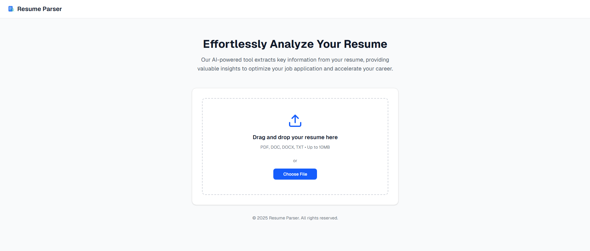

# 📄 Resume Parser (AI-powered)

An end-to-end **Resume Parser** that extracts structured information (Skills, Work Experience, Education, Languages) from resumes in **PDF/DOCX/TXT** formats.  
Built with **spaCy (NER model)**, **FastAPI backend**, and **React frontend**.

---

## 🚀 Project Highlights


- **Dataset:** 50 resumes (42 train, 8 dev, 10 test)  
- **Model:** Custom **spaCy NER** (trained from scratch)  
- **Best Test F1-score:** **91.33%** (overall)  
- **Entities extracted:** Skills, Work Experience, Education, Languages  

---

## 🖼️ Screenshots

**Upload Page**  


**Parsed Resume Results**  


---

## ✨ Features
- 📂 Upload resumes (PDF, DOCX, TXT).  
- 🤖 AI-powered extraction of:
  - 🎯 **Skills**
  - 💼 **Work Experience**
  - 🎓 **Education**
  - 🌍 **Languages**  
- 📊 Instant structured output for downstream use.  
- 💻 Web interface + REST API.  

---

## 🛠️ Tech Stack & Tools

- **Languages:** Python, TypeScript  
- **NLP Framework:** spaCy  
- **Backend:** FastAPI, Uvicorn  
- **Frontend:** React / Next.js  
- **Parsing Tools:** pdfplumber, docx2txt  
- **Data Annotation:** Label Studio  
- **DevOps & Tools:** Git, npm, Vercel
- **Methodologies:** Data preprocessing, tokenization, regex bootstrapping, model evaluation with F1/Precision/Recall  

---

## 🧠 Model Training

The custom **spaCy NER model** was trained on manually annotated resumes.

- **Dataset size:** 60 resumes  
- **Split:**  
  - 42 resumes → Training  
  - 8 resumes → Development (validation)  
  - 10 resumes → Test (final evaluation)  

Pipeline included:
- Text cleaning & normalization  
- Regex pre-labeling to speed up annotation  
- Train/dev/test splitting for fair evaluation  
- Iterative fine-tuning of model  

---

## 📊 Evaluation Results

On the held-out **test set (10 resumes)**:

| Metric | Score |
|--------|-------|
| **Precision (NER P)** | 91.12% |
| **Recall (NER R)**    | 91.55% |
| **F1-score (NER F)**  | 91.33% |

### Per-entity performance:

| Entity     | Precision | Recall | F1    |
|------------|-----------|--------|-------|
| 🎓 Education | 86.21     | 75.76  | 80.65 |
| 💼 Work Exp. | 69.23     | 81.82  | 75.00 |
| 🎯 Skill     | 94.96     | 95.65  | 95.31 |
| 🌐 Language  | 100.00    | 100.00 | 100.00 |


⚡ **Why not accuracy?**  
For NER tasks, **accuracy is misleading** because the majority of tokens are *not entities*. Instead, the **F1-score (harmonic mean of precision & recall)** is the gold-standard metric in NLP.  

---

## 🔧 Currently Improving Model Accuracy

I'm currently improving the accuracy of the Resume Parser using these methodologies:

### 📊 Data-Centric
- Expanding dataset with more annotated resumes (beyond current 50).  
- Annotating more **Work Experience** and **Education** entities to address weaker categories.  
- Reviewing and enforcing **annotation consistency** (e.g., clear rules for job titles, companies, skills).  

### 🤖 Model-Centric
- Experimenting with larger **spaCy models** (`en_core_web_md`, `en_core_web_lg`).  
- Fine-tuning **transformer-based models** (BERT, RoBERTa) using `spacy-transformers`.  
- Hyperparameter tuning: adjusting **learning rate, batch size, training iterations**.

---

## ⚡ Installation & Usage

### 1. Clone repo
```bash
git clone https://github.com/yourusername/resume-parser.git
cd resume-parser
```

### 2. Setup backend
```bash
cd backend
pip install -r requirements.txt
uvicorn main:app --reload
```

### 3. Setup frontend
```bash
cd frontend
npm install
npm run dev
```

### 4. Test API
```bash 
curl -X POST "http://localhost:8000/parse" \
     -F "file=@sample_resume.pdf"
```

## 📌 License

MIT License. Free to use & modify.
